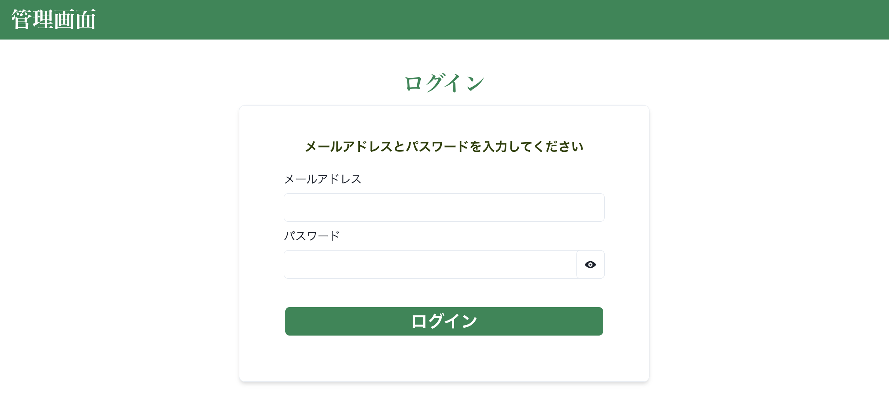
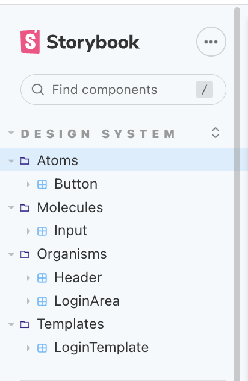
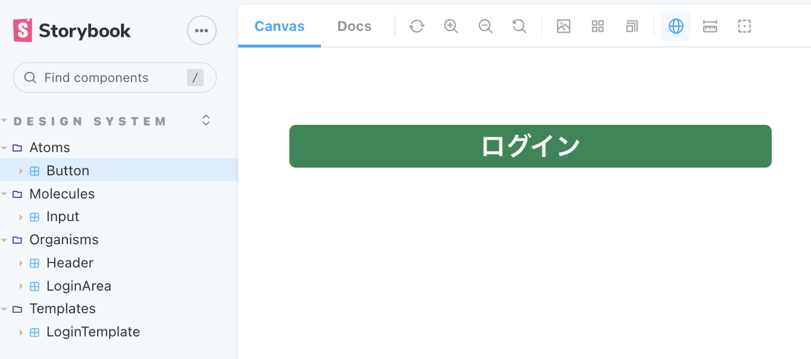
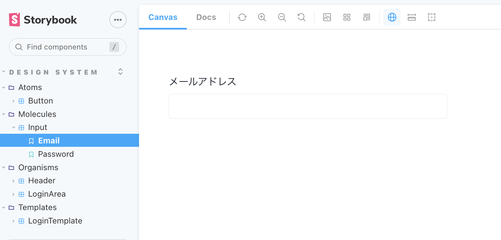
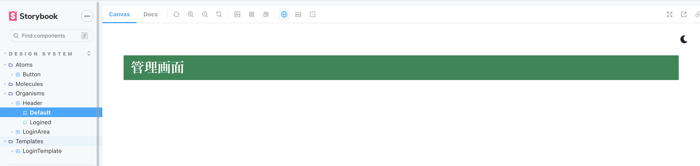
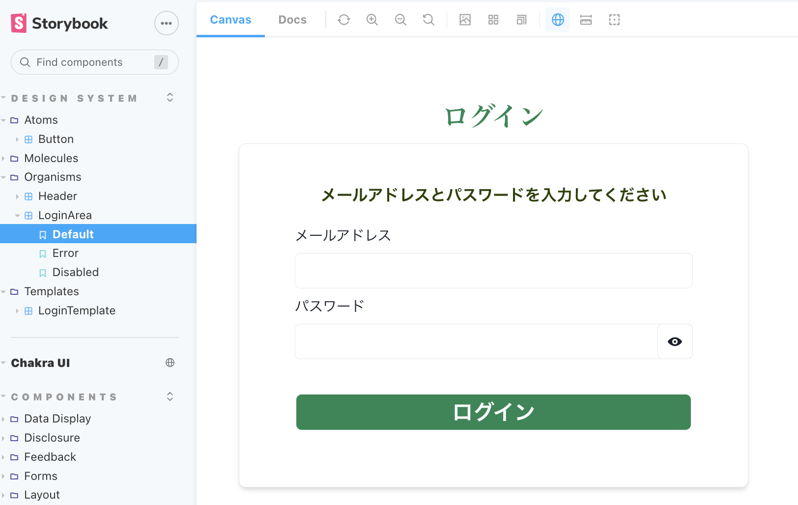
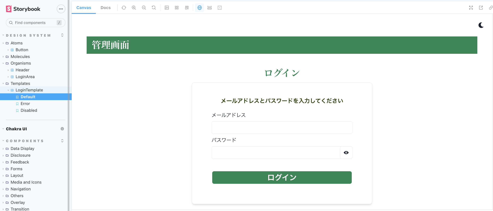
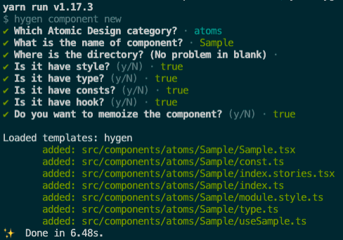
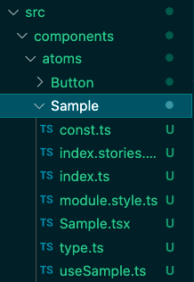

# Next.js の Atomic Design を採用したボイラープレート

詳細はまた追記します。

## 主な採用技術など

- Next.js
- TypeScript
- Chakra UI
- Storybook

## コマンド一覧

開発サーバー起動

```
yarn dev
```

Storybook 起動

```
yarn storybook
```

hygen によるコンポーネントテンプレート生成

```
yarn hygen
```

## サンプル画面

こんな簡単なログイン画面です。


## サンプルコンポーネント

以下のコンポーネントから構成されます。


### Atoms/Button



### Molecules/Input



### Organisms/Header



### Organisms/LoginArea



### Templates/LoginTemplate



## hygen によるコンポーネントテンプレート生成

下記コマンド実行して、新規作成するコンポーネントのテンプレートを作成できます。

```
yarn hygen
```

対話に従って、回答することで、


/components 配下にテンプレートが作成される。


